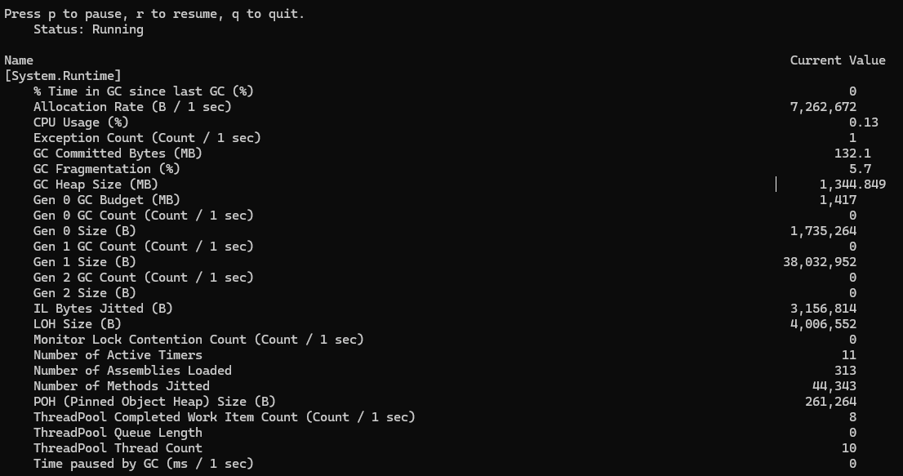

# شهبود کلی نسبت به سرویس از طریق dotnet-counters

یکی از ابزارهایی که برای بررسی وضعیت کلی سرویس ارائه شده 
`dotnet-counters`
است.

:::tip
از این ابزارها می‌توان در محیط توسعه و هم‌چنین در محیط عملیاتی استفاده کرد.

برای استفاده از لاگ‌ها در محیط‌های عملیاتی لازم است فایل‌های لاگ را خروجی بگیریم و بررسی کنیم.
:::


مستندات رسمی این ابزارها از 
[این آدرس](https://learn.microsoft.com/en-us/dotnet/core/diagnostics/tools-overview)
قابل دسترس است.

## ابزار dotnet-counters
برای مشاهده‌ی وضعیت کلی شرایط و منابعی که یک سرویس در حال استفاده است از ابزار
`dotnet-counters`
استفاده می‌کنیم.


### مشاهده‌ی وضعیت فعلی
برای نصب این ابزار روی سیستم خود از دستور زیر استفاده کنید.

```bash
dotnet tool install --global dotnet-counters
```

برای یافتن تمام پردازش‌های در حال اجرا از دستور زیر را وارد کنید.
```bash
dotnet-counters ps
```
 
سپس برای مشاهده‌ی جزئیات یک پردازش خاص از دستور زیر استفاده می‌شود.

```bash
dotnet-counters monitor --refresh-interval 1 -p 8096
```

این دستور خروجی مشابه زیر دارد.




:::tip
توجه کنید که حتما باید خط فرمان شما در حالت
administrator
باز شده باشد تا امکان اتصال به
process
خاص فراهم باشد.
:::

در این بخش موارد زیر به صورت هر ثانیه بروز می‌شوند و امکان مشاهده‌ی وضعیت سیستم را فراهم می‌کند.


برای آشنایی با مفاهیم و اطلاعات 
GC
پیشنهاد می‌شود 
[این راهنما](https://learn.microsoft.com/en-us/dotnet/standard/garbage-collection/fundamentals)
را مطالعه کنید. به صورت خاص در مورد نسل‌های 
GC
در 
[این لینک](https://learn.microsoft.com/en-us/dotnet/standard/garbage-collection/fundamentals#generations)
توضیح داده شده است.

برای آشنایی با مفاهیم
Thread pool
به 
[این لینک](https://learn.microsoft.com/en-us/dotnet/standard/threading/the-managed-thread-pool)
مراجعه کنید.
و فرایند رفع باگ و ریشه‌های آن در
[اینجا](https://learn.microsoft.com/en-us/dotnet/core/diagnostics/debug-threadpool-starvation)
توضیح داده شده است.


### فایل خروجی

می‌توان از داده‌ها خروجی به صورت فایل تهیه کرد که برای این کار می‌توانیم از دستورات زیر استفاده کنیم.

```
dotnet-counters collect -p 8096 --format json
```
```
dotnet-counters collect -p 8096 --format csv
```


توضیحات کامل استفاده از ابزار 
[dotnet-counter](https://learn.microsoft.com/en-us/dotnet/core/diagnostics/dotnet-counters)
در سایت‌های مرجع آمده است.


