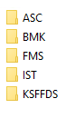
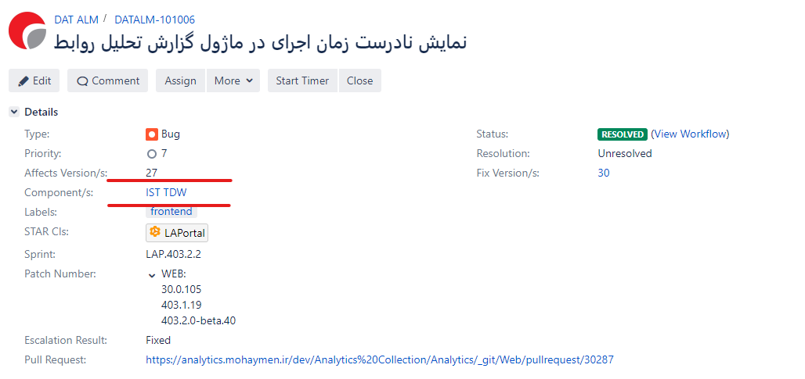
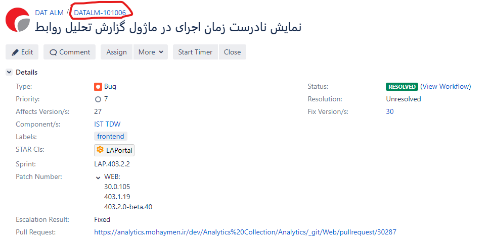
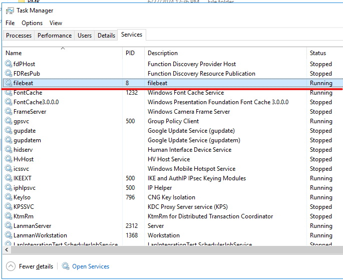
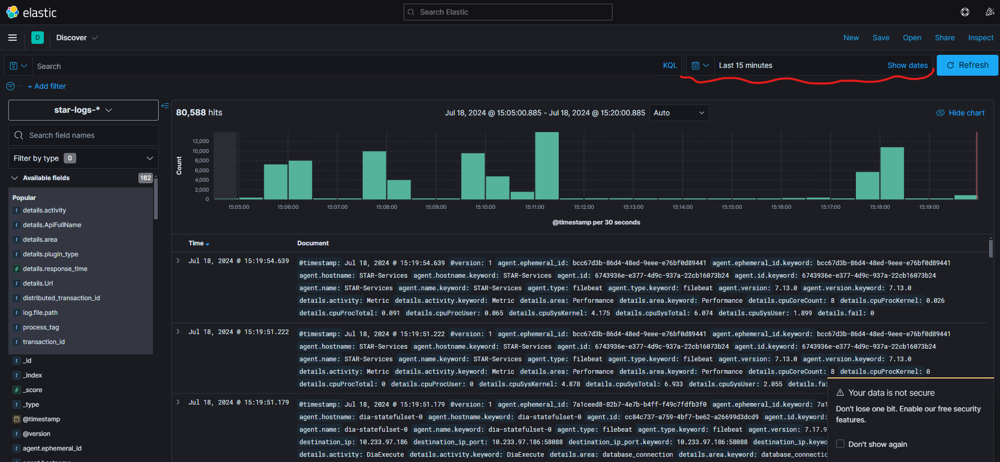
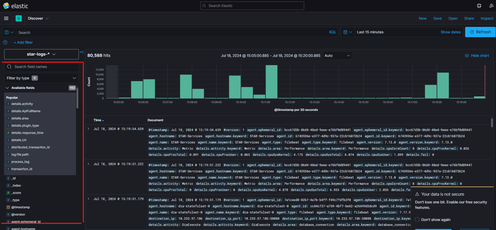
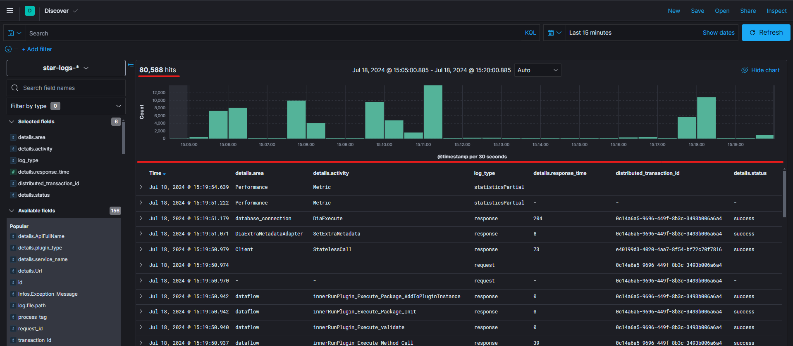

# دیباگ با استفاده از استک ELK (Elastic Logstash Kibana)

برای باگ‌هایی که به کندی یک عملکرد در سیستم مربوط است یکی از راه‌های دیباگ و تشخیص مشکل استفاده از لاگ‌های 
performance
که سرویس‌های ستاره ثبت می‌کنند استفاده کنیم.

## تشخیص سرویس‌های مرتبط
با توجه به ماژولی که با آن کار داریم و کندی در آن مشاهده می‌شود لاگ سرویس مربوط را از مشتری درخواست کرده و برای بارگذاری دانلود کنید.

## بارگذاری لاگ‌ها

برای بارگذاری و به اشتراک‌گذاری نتایج بین افراد مختلف داخل واحد یک نسخه‌ی کامل از استک
ELK
در دسترس است.
برای بارگذاری یک فایل لاگ لازم است مراحل زیر را طی بشود.

+ به سرور
  `192.168.30.83`
با نام کاربری و رمزعبوری که در اختیار دارید.
+ در آدرس زیر پوشه‌های مختلف به ازای هر پروژه ایجاد شده است.
پوشه‌ی متناظر با پروژه‌ی باگ گزارش شده را باز کنید. (برای اینکار از فیلد component در ایشوی باگ جیرا استفاده کنید.)

در مثال زیر در پوشه‌ی 
`IST`
مورد نظر است.

+ در پوشه‌ی مورد نظر یک پوشه‌ی جدید به همان نام آیدی ایشوی جیرا ایجاد کنید.
در مثال زیر شناسه‌ی ایشو در جیرا برابر مقدار 
`DATALM-101006`
است.

+ چون فایل‌های لاگ حجیم هستند معمولا به صورت فشرده نگه‌داری و ارسال می‌شوند. برای بارگذاری شدن مناسب لاگ‌ها باید آن‌ها را از حالت فشرده خارج کنید.
+ بررسی کنید که سرویس ویندوزی 
filebeat
در سرور 
در حال اجرا باشد و در صورتی که این سرویس 
stop 
شده باشد فرایند به درستی انجام نمی‌شود و باید آن را 
start
کنید.

## تحلیل لاگ‌ها

برای تحلیل لاگ‌ها روش‌های مختلفی در رابط کاربری کیبانا فراهم شده است.

### تحلیل لاگ با Discover

محیط 
Discover
کیبانا یک محیط برای مشاهده‌ی خام تمام لاگ‌های ثبت شده است. در این صفحه به سادگی می‌توانیم لاگ‌ها فیلتر کنیم. براساس برخی ستون‌ها مرتب‌سازی کنیم و برخی از مقادیر را از محدوده‌ی دید خود حذف کنیم. 

:::tip
این محیط مناسب رسم نمودارهای متنوع و با جزئیات نیست و فقط لاگ‌ها به صورت خام مشاهده می‌شود. برای نمودارهای پیچیده‌تر باید یک داشبورد بسازیم.
:::

این محیط از 
[این آدرس](http://192.168.30.101:5600/app/discover)
قابل دسترس است.

#### تغییر محدوده‌ی زمانی

در این بخش امکان تعیین محدوده‌ی زمانی نمایش لاگ‌ها وجود دارد.

:::tip
در ابتدای تحلیل این مقدار تا حدی که مطمئن باشید شامل تمام لاگ‌های مورد نظر است بزرگ کنید.
:::

#### اضافه کردن ستون‌های داده

در این بخش ستون‌های معروف و پرتکرار در لاگ‌ها به همراه امکان جستجو و اضافه کردن ستون‌ها به جدول وجود دارد.

با انتخاب یک ستون (در بخش ستون‌های معروف یا جستجوی دقیق ستون) ستون خاص به جدول سمت راست اضافه می‌شود و می‌توانیم مقدارها را به صورت دقیق مشاهده کنیم. 
#### مشاهده یا عدم مشاهده‌ی یک داده‌ی خاص در ستون‌های مختلف

با انتخاب هر یک از مقادیر در ستون‌های موجود در جدول اگر روی علامت + کلیک بشود این مقدار 
فیلتر
می‌شود یعنی فقط لاگ‌هایی که این مقدار را دارند نمایش داده می‌شوند.

در صورتی که روی علامت - کلیک بشود تمام لاگ‌هایی که این مقدار را دارند نشان داده نمی‌شوند. این ویژگی برای حذف لاگ‌های نامرتبط و تمرکز روی موارد مهم مفید است. 

#### مشاهده‌ی تجمع زمانی داده‌ها و تعداد کل داده‌های مطابق با فیلتر

در تمام لحظات تحلیل مطابق با فیلتر زمانی و فیلترهای ستون‌ها تعداد کل لاگ‌ها، فراوانی زمانی (صرفا از نظر تعداد) قابل مشاهده است.
همین موارد در برخی از تحلیل‌ها به ما کمک می‌کند و حائذ اهمیت است.

####
####

### تحلیل‌های تجمیعی با اسفتاده از Dashboard

برای تحلیل‌های تجمیعی و مشاهده‌ی وضعیت تجمیعی لاگ‌ها لازم است یک 
**داشبورد**
بسازیم و نمودارهای متفاوت را در آن تعریف کنیم تا امکان فهم کلی نسبت به لاگ‌های تجمیع‌شده وجود داشته باشد.

برای ادامه‌ی تحلیل لازم است مراحل زیر را طی کنیم.

+ یک داشبورد با نام مشخص و با مفهوم متناسب با کدایشوی باگ ایجاد کنید که در آینده به سادگی تشخیص دهیم هر داشبورد برای چه هدفی ساخته شده است.
  (پیشنهاد می‌شود که کد ایشو را در ابتدای عنوان داشبورد قرار دهید.)
+ فیلتر مورد نیاز برای محدود‌سازی لاگ‌ها را در ابتدای صفحه ایجاد کنید.
:::tip
یکی از راه‌های فیلتر کردن لاگ استفاده از کلید
`log.file.path`
کنید.

با توجه به روش
tokenizer
الستیک در صورتی که فقط یک بخش را فیلتر کنید هر مسیری که شامل آن بخش باشد فیلتر می‌شود و قابل مشاهده خواهد بود. 
:::
+ سپس برای پاسخ به هر یک از سوالات و احتمالات مطرح شده نیاز است یک نمودار خاص برای این تحلیل استفاده شود.
در کیبانا هر نمودار یک 
Lens
نامیده می‌شود.

در 
[این ویدیو](https://www.youtube.com/watch?v=DzGwmr8nKPg)
توضیحات کلی در مورد ساخت داشبورد و نمودار داده شده است.

انواع روش‌های تجمیع‌سازی به تفصیل و با جزئيات مورد نیاز در 
[این ویدیو](https://www.youtube.com/watch?v=j-eCKDhj-Os)
توضیح داده شده است.

:::tip
استفاده از 
percentile
در تحلیل‌ها بسیار مفید است و کمک می‌کند نسبت به داده‌ها دید خوبی بگیریم و فقط به حداقل و حداکثر داده‌ها محدود نمی‌شویم و در عمل بهتر نسبت به توزیع‌داده شهود پیدا می‌کنیم.
:::

## مشخصات و کلیدهای معروف در لاگ‌ها

<table>
<tr>
<td>نام کلید</td>
<td>شرح</td>
<td>مثال‌های معروف</td>
</tr>

<tr>
<td>
`details.area`
</td>
<td>
هر لاگ مربوط به یک بخش بزرگ از کد است. برای تفکیک لاگ‌های مرتبط با یک منطق و فعالیت مشخص از این کلید استفاده می‌شود و آن را فیلتر می‌کنیم.
</td>
<td>
`Client`
برای مواقعی است که سرویس مورد نظر کلاینت است و به دیگر سرویس‌ها درخواست داده است.

`Server`
برای مواقعی است که سرویس مورد نظر، سرور بوده به کاربران پاسخ داده است.
</td>
</tr>
<tr>
<td>
`details.activity`
</td>
<td>
منطق و کاری که انجام شده است و منجر به ایجاد شدن این لاگ شده است.
</td>
<td>
هر مقدار
`details.area`
دارای مقادیر مشخصی است که باید با استفاده از کد منطق دقیق‌ را متوجه شویم.
</td>
</tr>
<tr>
<td>
`log_type`
</td>
<td>
به ازای هر عملیات در ستاره یک لاگ شروع و پایان وجود دارد که در این فیلد مشخص می‌شود.
</td>
<td>
مقدار‌های این فیلد 
`response`
(لاگ انتهای عملیات)
یا 
`request`
(لاگ ابتدای عملیات)
است.
</td>
</tr>

<tr>
<td>`process_tag`</td>
<td>
این کلید ترکیب مقدارهای 
`details.area`,
`details.activity`,
`log_type`
است
</td>
<td>
`dataflow.short_time_service_execute.Request`
</td>
</tr>

<tr>
<td>
`details.response_time`
</td>
<td>
این کلید فقط در لاگ‌ها با 
`log_type = response`
وجود دارد و فاصله‌ی زمانی بین 
`request`
و 
`response`
را با واحد میلی‌ثانیه نشان می‌دهد.
</td>
<td>
مقدار زیاد و بیش از حد انتظار در عملیات‌ها نشان‌دهنده‌ی کندی در سیستم است.
</td>
</tr>

<tr>
<td>
`transaction_id`
</td>
<td>
یک شناسه‌ی که برای درخواست‌ها در محدوده‌ی سرویس یکتاست

می‌توان از طریق فیلتر کردن روی این مقدار تمام لاگ‌های مرتبط با یک عملیات مشخص در یک سرویس را مشاهده کرد. 
</td>
<td>
`3eaeb0a2-b00d-4c95-9eb8-59fea3243806`
</td>
</tr>

<tr>
<td>`distributed_transaction_id`</td>
<td>
این مقدار شناسه‌ی یکتا بین چند سرویس است و در صورتی که یک سرویس به سرویس‌های متعدد درخواست بدهد این شناسه بین تمام لاگ‌های ثبت شده توسط همه‌ی سرویس‌ها یکتاست.

با فیلتر کردن این مقدار امکان دسترسی به تمام لاگ‌ها وجود دارد. 
</td>
<td>
`13fb7e67-d595-47c6-b1ce-2be8e2912bcf`
</td>
</tr>

<tr>
<td>`log.file.path`</td>
<td>
در زمان بارگذاری لاگ‌ها، هر فایل یک 
path
مشخص دارد و آدرس اولیه‌ی آن برای پیگیری بهتر لاگ‌ها و فیلتر کردن برای تحلیل استفاده می‌شود.
</td>
<td>
`D:\Program Files\Mohaymen\StarLogs\26\AM\MOHAYMEN_STAR-SERVICES$\Performance\20240723.json`
</td>
</tr>

</table>