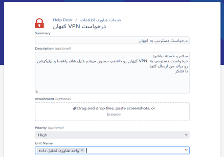
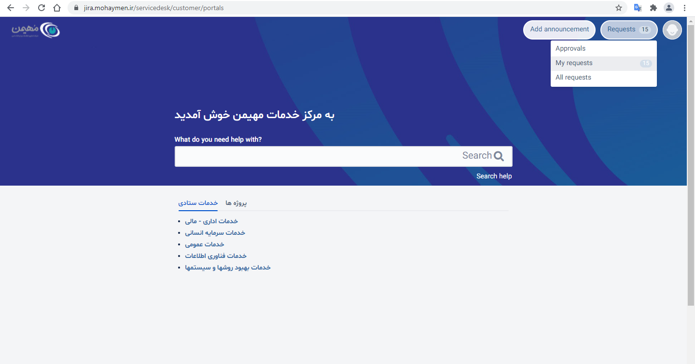
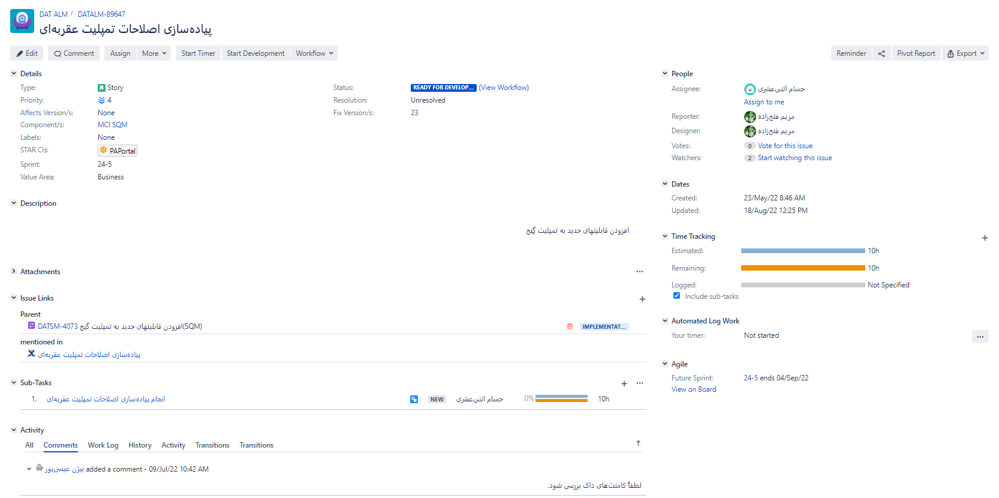
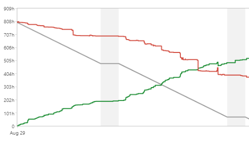
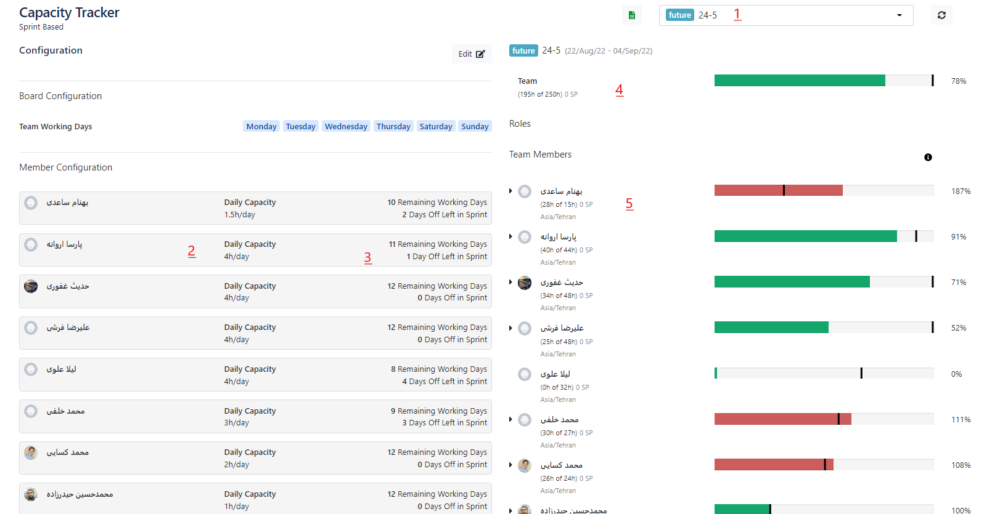
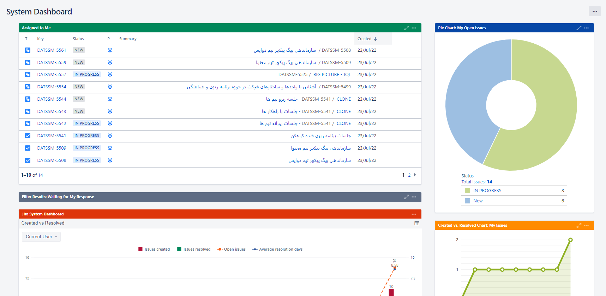
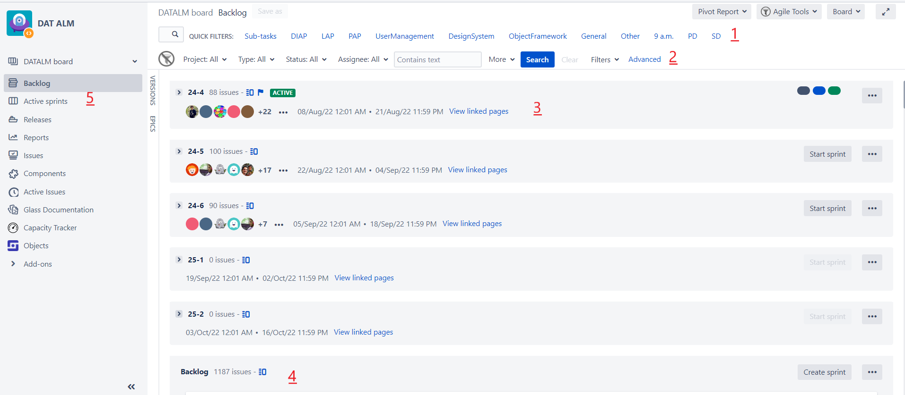
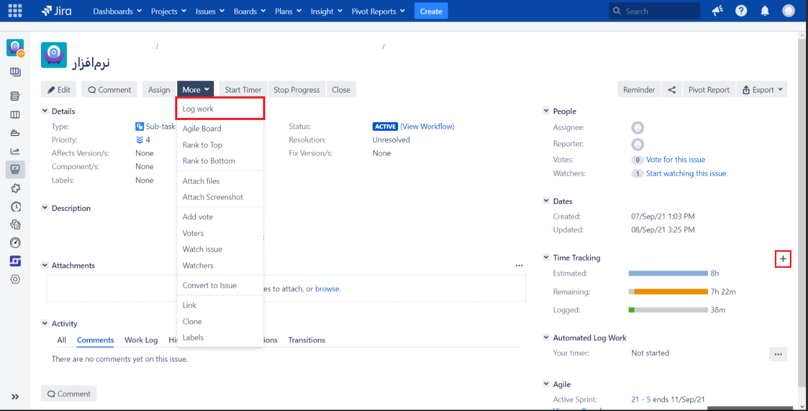

# شروع به کار

سلام! ورود شما را به یکی از بخش‌های جذاب و هیجان‌انگیز شرکت مهیمن تبریک می‌گوییم. امیدواریم در کنار هم تجربیات جدیدی کسب کنیم و از یکدیگر بیشتر و بیشتر یاد بگیریم.

صفحه زیر یک راهنمای مختصر برای آشنایی اولیه شماست که سعی کردیم تا جای ممکن کاربردی بودن آن را حفظ کنیم به همین خاطر توصیه می‌کنیم "حتماً" بادقت بخوانید.

ضمناً شما در شرکت مهیمن، عضو «واحد فناوری تحلیل داده» هستید، به طور خلاصه در واحد فناوری داده چهار بخش اصلی داریم:

1. طراحی محصول
2. توسعه نرم‌افزار (شما اینجا هستید!)
3. دواپس (DevOps)
4. برنامه‌ریزی و هماهنگی

## موارد عمومی

از لینک زیر می‌توانید موارد کلی مربوط به زندگی در مهیمن را مطالعه کنید (اختیاری):

[به مهیمن خوش آمدید](https://confluence.mohaymen.ir/pages/viewpage.action?pageId=48576968)

در این بخش سه مورد از کاربردی‌ترین موارد آن صفحه را به شما معرفی می‌کنیم:

### VPN

برای اتصال به سامانه‌ها و سرویس‌های شرکت شما نیاز دارید تا از
VPN
رسمی شرکت استفاده کنید.
برای دسترسی به
VPN
از طریق
[این لینک](https://jira.mohaymen.ir/servicedesk/customer/portal/83/create/1017)
درخواست خود را ثبت کنید تا همکاران واحد زیرساخت شرکت، اپلیکیشن کیهان و سند راهنما را در اختیار شما قرار دهند.



### تغییر رمز عبور

برای تغییر عبور در صفحه زیر، بخش «آموزش تغییر رمز عبور ایمیل
mohaymen.ir
» را مطالعه کنید:

[آموزش پیکر بندی ایمیل Mohaymen.ir در Outlook برای کامپیوتر و موبایل](https://confluence.mohaymen.ir/pages/viewpage.action?pageId=16089891)

### راهنمای استفاده از سامانه مدیریت حضور و غیاب (tms)

مهیمن برای ثبت ترددها و حضور و غیاب از سامانه
TMS
استفاده می‌کند.

برای استفاده از این سامانه حتماً صفحه زیر را مطالعه کنید:

[راهنمای استفاده از سامانه مدیریت حضور و غیاب (tms)](https://confluence.mohaymen.ir/pages/viewpage.action?pageId=60620989)

### درخواست دسترسی به ماشین‌های واحد فناوری تحلیل داده

برای اتصال به ماشین‌های مجازی مورد نیازِ روزمره باید یک درخواست به واحد زیرساخت شرکت ثبت کنید که دسترسی شما را به
IP
و
Port
ماشین‌ها باز کنند. برای ثبت درخواست مراحل زیر را انجام دهید:

1. روی لینک روبرو کلیک کنید:
   https://jira.mohaymen.ir/servicedesk/customer/portal/83/create/1209

2. در قسمت
   Summary
   این متن‌ را
   copy/paste
   کنید: درخواست دسترسی به ماشین‌های واحد فناوری تحلیل داده

3. در قسمت
   Description
   متن‌ زیر را
   copy/paste
   کنید:

```
سلام

لطفاً دسترسی به آدرس‌های زیر برای تمام پرت‌ها و روی وی پی ان شرکت فراهم شود. با تشکر.

این موضوع در راستای تیکت زیر زده شده:
https://jira.mohaymen.ir/servicedesk/customer/portal/83/IITSSD-5488

لیست آدرس‌ها:
**
با تشکر
```

4. دکمه
   Create
   را بزنید.

به منظور پیگیری درخواست خود باید وارد
[مرکز خدمات مهیمن](https://jira.mohaymen.ir/servicedesk/customer/portals)
شده و از قسمت
My requests
که در شکل زیر مشخص است، وضعیت درخواست خود را مشاهده کنید.



### درخواست سیستم و استفاده از آن به صورت ریموت

اگر در منزل سیستم ضعیفی داشته باشید که امکان استفاده از آن در پروژه‌های بزرگ وجود نداشته باشد، می‌توانید با هماهنگی با سرپرست خود و ثبت درخواست در سامانه از سیستمی که شرکت به وسیله اتصال ریموت در اختیار شما قرار می‌دهد استفاده کنید. برای ثبت درخواست می‌توانید از لینک زیر استفاده کنید:

https://jira.mohaymen.ir/servicedesk/customer/portal/83/create/1032

بعد از تایید و اختصاص سیستم،
IP
سیستم به شما داده می‌شود و شما می‌توانید از طریق
VPN
به آن متصل شوید.

## معرفی سیستم چابک Agile

### اسکرام

چهارچوب اسکرام به طور خلاصه شامل بازه‌های تکرار شونده دو تا چهار هفته ای ست که با نام اسپرینت شناخته می‌شود، در هر اسپرینت اسکرام مستر با توجه به اولویت‌های کارفرما و تیم تعدادی از استوری‌ها را که در مکانی به نام بکلاگ ذخیره شده اند، انتخاب کرده و آنها را به اعضای تیم توضح می‌دهد و به هر فرد اختصاص داده می‌شود، افراد تیم در طول اسپرینت تسک‌هایی که به آنها محول شده را کامل کرده و در پایان اسپرینت با بررسی فرآیندی طی شده و ثبت بازخورد تلاش می‌کنند تا اسپرینت بعدی را بهبود دهند.

### اسپرینت

در مجموعه ما بازه اسپرینت‌ها دو هفته‌ای است که روز دوشنبه شروع می‌شود و سیزده روز بعد در روز یکشنبه به اتمام می‌رسد.

### استوری

استوری‌ها نیازمندی‌های سیستم هستند که توسط تیم یا مشتری ایجاد می‌شوند. هر استوری می‌تواند به تعدادی ساب تسک شکسته شود و شامل توضیحات، زمان تخمینی برای به پایان رساندن، شرایط پذیرشِ به اتمام رسیدن و شخص مسئول باشد.

### ساب‌تسک

معمولاً هر استوری به تعدادی ساب‌تسک شکسته می‌شود. ساب‌تسک‌ها مراحل انجام کار برای استوری را نمایش می‌دهند و هر ساب‌تسک به یک نفر اساین( Assign ) می‌شود. ساب‌تسک‌ها در جلسه برنامه‌ریزی اسپرینت مشخص شده و با توجه به اندازه استوری، تعداد و انواع ساب‌تسک‌ها متغیر است. در ادامه سند درباره نحوه انجام ساب‌تسک توضیح داده خواهد شد.

### جلسات

در هر اسپرینت تعدادی جلسه وجود دارد که هر یک از آنها اهداف مخصوص خود را دارد و در زمان‌های مشخص با اعضای تیم برگزار می‌شود.

### جلسه روزانه

جلسات روزانه جلسات کوتاهی هستند که هر صبح برگزار می‌شوند و طی این جلسات هر نفر به سه سوال پاسخ می‌دهد.

دیروز چه کاری انجام دادید؟
امروز چه کاری انجام می‌دهید؟
آیا با مانع یا چالشی مواجه هستید؟

### جلسه برنامه ریزی

جلسه برنامه ریزی قبل از شروع اسپرینت برگزار می‌شود و طی این جلسه وظایف نفرات مشخص می‌شود و استوری‌هایی به آنها داده می‌شود.

### جلسه گذشته نگر

جلسه گذشته نگر یا
Retrospective
یک بار در انتهای اسپرینت برگزار می‌شود. طی این جلسه هر شخص حداکثر دو موردی که در طی اسپرینت به عنوان ویژگی‌ها(ویژگی‌های شخصی، گروهی، حال و احوال، فنی یا ...) یا اتفاقات خوبی که باعث جلب نظرش شدند، در کنار حداکثر دو ویژگی‌ یا اتفاقی که مشکلی به وجود اوردند یا به هر نحو در نظرش نقاط منفی اسپرینت بودند را مطرح می‌کند. در ادامه جلسه افراد حاضر درباره این ویژگی‌ها یا اتفاقات گفتگو کرده و در انتها تعدادی از نقاط منفی اسپرینت براساس رأی گیری انتخاب شده و با تعیین مسئول پیگری آنها سعی در ترمیم این ویژگی‌ها در اسپرینت بعدی داریم. همچنین گزارش این پیگیری در جلسه بعدی گذشته نگر تحویل داده می‌شود.

## جیرا و کانفلوئنس

### معرفی کلی

ابزار مدیریت پروژه و مدیریت زمان که در مهیمن استفاده می‌شود
[Jira](https://jira.mohaymen.ir/)
است. محصول جیرا یکی از محصولات شرکت
[Atlassian](https://www.atlassian.com/software/jira)
است. با جیرا می‌توانید کارهای خود را تعریف و انجام آنها را مدیریت کنید. می‌توانید آموزش کامل کار با جیرا را از صفحه
[آموزش کار با جیرا](https://confluence.mohaymen.ir/pages/viewpage.action?pageId=17039587)
مشاهده کنید؛ البته مطالعه این سند کاملاً اختیاری است، به دلیل جامع بودن سند در ادامه توضیحات مختصر و کاربردی که به آنها نیاز دارید را بازگو میکنیم.

در شرکت مهیمن به منظور اشتراک گذاری مستندات نوشتاری با دیگران و همچنین دسترسی به همه مستندات موجود شرکت از
Confluence
استفاده می‌شود. کانفلوئنس مانند جیرا محصول شرکت
[Atlassian](https://www.atlassian.com/software/confluence)
است. کار با کانفلوئنس مانند یک ادیتور ساده متنی است. می‌توانید آموزش کامل کار با کانفلوئنس را از این صفحه مشاهده کنید:
[آموزش کار با کانفلوئنس - Confluence](https://confluence.mohaymen.ir/pages/viewpage.action?pageId=13830616)

### معرفی بخش‌های مختلف یک ایشو

در واحد فناوری تحلیل داده با پنج نوع مختلف ایشو مواجه هستیم:
Story، Bug، Task، Epic، Initiative، Sub-task.
در ادامه توضیح بعضی از آنها را خدمت شما ارائه می‌دهیم. قالب کلی ایشوها یکسان است و شاید تفاوت‌های کوچکی با هم داشته باشند. تصویر زیر یک ایشوی نمونه را نمایش می‌دهد:



* هر ایشو یک عنوان دارد، عنوان این ایشو «پیاده سازی اصلاحات تمپلیت عقربه ای» است.
* در پایین عنوان دکمه‌های کارکردی مربوط به ایشو وجود دارد. افراد با سطح دسترسی مختلف، ممکن است دکمه‌های متفاوتی را ببینند
* قسمت
  Details
  جزئیاتی از ایشو را نمایش میدهد. تصویر بالا یک استوری است، که اولویت 4 دارد و در کامپوننت
  PAPortal
  قرار دارد. اسپرینت آن مشخص شده. وضعیت
  READY FOR DEVELOPMENT
  و در نسخه 23 پیاده میشود.
* در
  Description
  و
  Attachments
  توضیحات و فایل‌های ضمیمه ایشو قرار می‌گیرند
* Issue Links
  ایشوها یا صفحات کانفلوئنسی که مرتبط با این ایشو است را نشان می‌دهد
* اگه ایشو داراری ساب‌تسک
  (Sub-task)
  باشد در محل خودش دیده می‌شود که این ایشو یک ساب تسک دارد
* قسمت
  Activity
  مربوط به کارهای هر ایشو است: کامنت‌ها، زمان‌های صرف شده، تاریخچه تغییرات ایشو و بقیه موارد که در ادامه همکاری به شما آموزش داده می‌شود.
* سمت راست افراد درگیر ایشو را نشان می‌دهد: این ایشو به چه کسی
  Assignee
  شده، چه کسی ایشو را گزارش کرده و غیره.
* در قسمت
  Dates
  تاریخ ایجاد و تغییرات ایشو را می‌بینید.
* در قسمت
  Time Tracking
  زمان‌هایی که مرتبط به ایشو است نشان داده می‌شود (بعداً در این باره توضیح می‌دهیم)

### نمودارها و بُردها

جیرا گزارش‌هایی را در قالب تعدادی نمودار و بُرد در اختیار ما قرار می‌دهد که بتوانیم روی کیفیت کار انجام شده توسط خود، تیم یا کل مجموعه تسلط پیدا کنیم، در ادامه کاربرد و نحوه استفاده تعدادی از این امکانات را برای شما توضیح می‌دهیم.

#### نمودار Burndown

این نمودار میزان کار انجام شده توسط اعضای تیم را در کنار میزان کار باقی‌مانده نمایش می‌دهد.



در نمودار بالا خط قرمز رنگ ساعت کار باقی مانده و خط سبز رنگ ساعت کار انجام شده در طول اسپرینت را نشان می‌دهند. اگر پیشرفت تیم در طول اسپرینت در سطح خوبی باشد، خط قرمز نزدیک به خط طوسی معیار پیش می‌رود. هرچقدر فاصله بیشتری وجود داشته باشد نشان دهنده پیش نرفتن کارهاست و باید در جلسات روزانه بررسی شود.

#### ابزار Capacity Tracker

Capacity tracker
یکی از ابزار های جیراست که با استفاده از آن میتوان از ظرفیت روزانه اسپرینت هر فرد(2)، روزهای کاری و مرخصی(3)، ظرفیت کلی تیم(4) و درصد کارهای باقی مانده نسبت به روزهای کاری آتی(5) مطلع شد.



به طور مثال در تصویر بالا

1. ما در حال مشاهده Capacity Tracker در اسپرینت 24-5 هستیم
2. در این اسپرینت ظرفیت روزانه اسپرینت آقای پارسا اروانه 4 ساعت در روز اعلام شده است، این ظرفیت با توجه به نقش، میزان ساعت کاری و تیم شما متفاوت خواهد بود
3. پارسا اروانه یازده روز کاری و یک روز مرخصی در طول این اسپرینت خواهد داشت
4. ظرفیت کلی تیم 250 ساعت است که به مقدار 195 ساعت کار، تسک در این اسپرینت وجود دارد
5. بهنام ساعدی در این اسپرینت 15 ساعت ظرفیت دارد و 26 ساعت کار به ایشان اساین شده ( البته این مورد با نظارت مدیر تیم و اسکرام مستر اصلاح شده و به هر نفر فقط به اندازه ظرفیتش تسک اساین می‌شود)

#### داشبورد شخصی

هر نفر در جیرا یک داشبورد شخصی دارد و می‌تواند کارهایی که به او اساین شده است را در یک نما ببیند. از لینک زیر می‌توانید داشبورد شخصی خود را ببینید:

https://jira.mohaymen.ir/secure/Dashboard.jspa?selectPageId=10000



#### بُرد عمومی

در جیرا یک برد عمومی وجود دارد که از طریق آن همه ایشو های موجود قابل مشاهده اند. هر تیم توسعه نرم‌افزار برد مخصوص خود را دارد که ایشوها محدودتر اند و فقط ایشو های مرتبط با آن تیم در آن وجود دارد. در این برد اعضای تیم می‌توانند لیست وظایف انجام نشده، در حال انجام و یا انجام شده خودشان را ببینند. لینک برد عمومی:
https://jira.mohaymen.ir/secure/RapidBoard.jspa?rapidView=187&view=planning&issueLimit=100

تصویر زیر برد عمومی را با نام
DATALM board
نمایش می‌دهد.



1. یک سری از فیلترهای از پیش تعیین شده در این قسمت نمایش داده می‌شود
2. در این قسمت میتتوانید فیلترهای مورد علاقه خود را اعمال کنید
3. محل نمایش اسپرنت ها
4. بکلاگ محل کارهایی است که اولویت بندی شده و برای اسپرینت‌های بعدی در صف انجام هستند
5. در نوار سمت چپ، Active sprints وجود دارد که می‌توانید کارهای خود و بقیه را به تفکیک ببینید.

#### بُرد هر تیم

همانطور که گفتیم هر تیم یک برد اختصاصی دارد. برد اختصاصی تیم‌های مختلف توسعه نرم‌افزار را می‌توانید در پایین ببینید:

[DATALM - DIA](https://jira.mohaymen.ir/secure/RapidBoard.jspa?rapidView=312&view=planning&issueLimit=100)

[DATALM - PA](https://jira.mohaymen.ir/secure/RapidBoard.jspa?rapidView=307&view=planning&issueLimit=100)

[DATALM - LA](https://jira.mohaymen.ir/secure/RapidBoard.jspa?rapidView=320&view=planning&issueLimit=100)

#### اکتیوکردن ساب‌تسک

اگر قصد انجام یک ساب-تسک را دارید می‌بایست وضعیت ساب‌تسک را به
Active
تغییر دهید، این کار را به دو صورت می‌توانید انجام دهید:

روش اول: وارد صفحه ساب‌تسک شده و روی دکمه
Start Progress
کلیک کنید.


روش دوم: در برد تیم، قسمت
Active sprints
ساب‌تسک مورد نظر را گرفته، از قسمت
To Do
به قسمت
In Progress
بکشید و رها کنید.

.png)

#### ثبت ورکلاگ

برای پیش بینی میزان زمانبر بودن ساب‌تسک‌ها، زمانی که روی انجام هر ساب‌تسک گذاشته می‌شود را باید ثبت می‌کنیم.

برای ثبت زمان هر ساب‌تسک(همچنین باگ) همان طور که در تصویر زیر نشان داده شده قبل از شروع کار روی ساب‌تسک می‌توانید روی دکمه
Start Timer
کلیک کنید.


بعد از اتمام همه یا بخشی از ساب‌تسک می‌توانید روی دکمه
Stop Timer
که در تصویر پایین نمایش داده شده کلیک کنید تا زمان محاسبه شده توسط زمان‌سنج نمایش داده شود.


بعد از کلیک روی دکمه
Stop Timer
صفحه پایین به شما نمایش داده می‌شود.


در قسمت 1 زمان نمایش داده می‌شود که می‌توانید این زمان را ویرایش کرده و با کلیک بر روی دکمه
Log
در قسمت 2 این زمان را برای خود ثبت کنید.

در صورتی که فراموش کردید موقع انجام ساب-تسک زمان ثبت کنید، با کلیک روی دکمه
More
سپس
Log work
می‌توانید پنجره ثبت زمان را باز کنید و زمان را به صورت دستی وارد کنید. همین کار را می‌توانید با کلیک روی علامت + در ستون سمت راست بخش
Time Tracking
هم انجام دهید.



پ.ن: در هنگام ثبت ورکلاگ به این موضوع دقت کنید که زمان شروع و پایان ورکلاگ اهمیت چندانی ندارد و مهم مجموع فعالیت مفید روی یک ایشو می‌باشد، به عنوان مثال شما در طول روز در بازه‌های 20 دقیقه‌ای روی یک ایشو کار کرده‌اید و در پایان روز حدود 4 بار به کار روی ایشو وقت اختصاص داده‌اید. در این موقعیت می‌توانید در پایان روز یک ورکلاگ برای یک ساعت و بیست دقیقه زمانی که صرف ایشو شده است ثبت کنید(نیازی به تغییر مقدار پیش‌فرض زمان شروع ورکلاگ نیست ).   