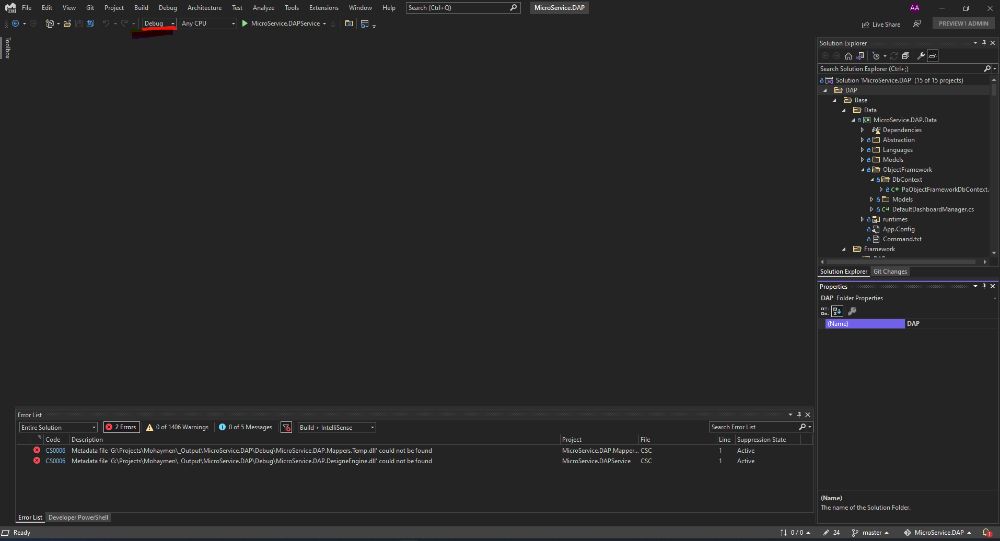
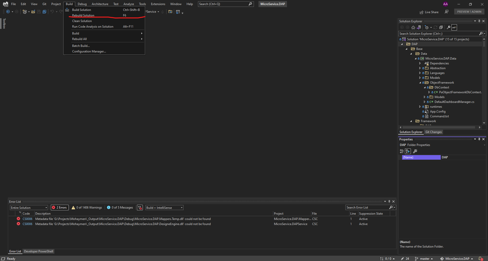
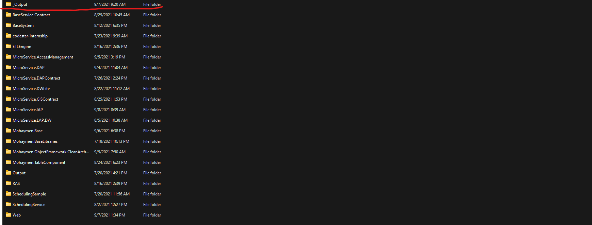
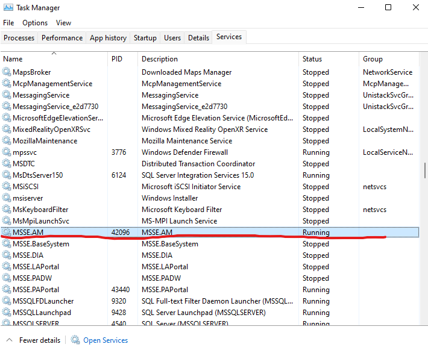
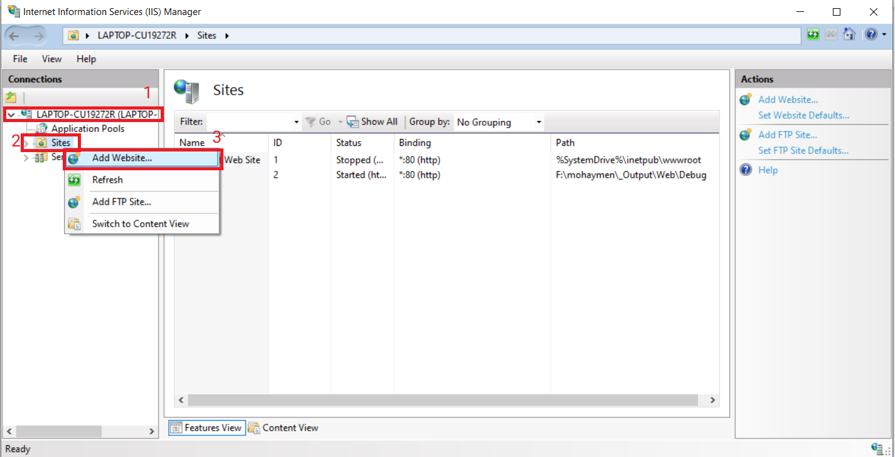

# شروع به کار

سلام! ورود شما را به یکی از بخش‌های جذاب و هیجان‌انگیز شرکت مهیمن تبریک می‌گوییم. امیدواریم در کنار هم تجربیات جدیدی کسب کنیم و از یکدیگر بیشتر و بیشتر یاد بگیریم.

صفحه زیر یک راهنمای مختصر برای آشنایی اولیه شماست که سعی کردیم تا جای ممکن کاربردی بودن آن را حفظ کنیم به همین خاطر توصیه می‌کنیم "حتماً" بادقت بخوانید.

ضمناً شما در شرکت مهیمن، عضو «واحد فناوری تحلیل داده» هستید، به طور خلاصه در واحد فناوری داده چهار بخش اصلی داریم:

1. طراحی محصول
2. توسعه نرم‌افزار (شما اینجا هستید!)
3. دواپس (DevOps)
4. برنامه‌ریزی و هماهنگی

## موارد عمومی

از لینک زیر می‌توانید موارد کلی مربوط به زندگی در مهیمن را مطالعه کنید (اختیاری):

[به مهیمن خوش آمدید](https://confluence.mohaymen.ir/pages/viewpage.action?pageId=48576968)

در این بخش سه مورد از کاربردی‌ترین موارد آن صفحه را به شما معرفی می‌کنیم:

### VPN

برای اتصال به سامانه‌ها و سرویس‌های شرکت شما نیاز دارید تا از
VPN
رسمی شرکت استفاده کنید.
برای دسترسی به
VPN
از طریق
[این لینک](https://jira.mohaymen.ir/servicedesk/customer/portal/83/create/1017)
درخواست خود را ثبت کنید تا همکاران واحد زیرساخت شرکت، اپلیکیشن کیهان و سند راهنما را در اختیار شما قرار دهند.


### تغییر رمز عبور

برای تغییر عبور در صفحه زیر، بخش «آموزش تغییر رمز عبور ایمیل
mohaymen.ir
» را مطالعه کنید:

[آموزش پیکر بندی ایمیل Mohaymen.ir در Outlook برای کامپیوتر و موبایل](https://confluence.mohaymen.ir/pages/viewpage.action?pageId=16089891)

### راهنمای استفاده از سامانه مدیریت حضور و غیاب (tms)

مهیمن برای ثبت ترددها و حضور و غیاب از سامانه
TMS
استفاده می‌کند.

برای استفاده از این سامانه حتماً صفحه زیر را مطالعه کنید:

[راهنمای استفاده از سامانه مدیریت حضور و غیاب (tms)](https://confluence.mohaymen.ir/pages/viewpage.action?pageId=60620989)

### درخواست دسترسی به ماشین‌های واحد فناوری تحلیل داده

برای اتصال به ماشین‌های مجازی مورد نیازِ روزمره باید یک درخواست به واحد زیرساخت شرکت ثبت کنید که دسترسی شما را به
IP
و
Port
ماشین‌ها باز کنند. برای ثبت درخواست مراحل زیر را انجام دهید:

1. روی لینک روبرو کلیک کنید:
   https://jira.mohaymen.ir/servicedesk/customer/portal/83/create/1209

2. در قسمت
   Summary
   این متن‌ را
   copy/paste
   کنید: درخواست دسترسی به ماشین‌های واحد فناوری تحلیل داده

3. در قسمت
   Description
   متن‌ زیر را
   copy/paste
   کنید:

```
سلام

لطفاً دسترسی به آدرس‌های زیر برای تمام پرت‌ها و روی وی پی ان شرکت فراهم شود. با تشکر.

این موضوع در راستای تیکت زیر زده شده:
https://jira.mohaymen.ir/servicedesk/customer/portal/83/IITSSD-5488

لیست آدرس‌ها:
**
با تشکر
```

4. دکمه
   Create
   را بزنید.

به منظور پیگیری درخواست خود باید وارد
[مرکز خدمات مهیمن](https://jira.mohaymen.ir/servicedesk/customer/portals)
شده و از قسمت
My requests
که در شکل زیر مشخص است، وضعیت درخواست خود را مشاهده کنید.


### درخواست سیستم و استفاده از آن به صورت ریموت

اگر در منزل سیستم ضعیفی داشته باشید که امکان استفاده از آن در پروژه‌های بزرگ وجود نداشته باشد، می‌توانید با هماهنگی با سرپرست خود و ثبت درخواست در سامانه از سیستمی که شرکت به وسیله اتصال ریموت در اختیار شما قرار می‌دهد استفاده کنید. برای ثبت درخواست می‌توانید از لینک زیر استفاده کنید:

https://jira.mohaymen.ir/servicedesk/customer/portal/83/create/1032

بعد از تایید و اختصاص سیستم،
IP
سیستم به شما داده می‌شود و شما می‌توانید از طریق
VPN
به آن متصل شوید.

## معرفی سیستم چابک Agile

### اسکرام

چهارچوب اسکرام به طور خلاصه شامل بازه‌های تکرار شونده دو تا چهار هفته ای ست که با نام اسپرینت شناخته می‌شود، در هر اسپرینت اسکرام مستر با توجه به اولویت‌های کارفرما و تیم تعدادی از استوری‌ها را که در مکانی به نام بکلاگ ذخیره شده اند، انتخاب کرده و آنها را به اعضای تیم توضح می‌دهد و به هر فرد اختصاص داده می‌شود، افراد تیم در طول اسپرینت تسک‌هایی که به آنها محول شده را کامل کرده و در پایان اسپرینت با بررسی فرآیندی طی شده و ثبت بازخورد تلاش می‌کنند تا اسپرینت بعدی را بهبود دهند.

### اسپرینت

در مجموعه ما بازه اسپرینت‌ها دو هفته‌ای است که روز دوشنبه شروع می‌شود و سیزده روز بعد در روز یکشنبه به اتمام می‌رسد.

### استوری

استوری‌ها نیازمندی‌های سیستم هستند که توسط تیم یا مشتری ایجاد می‌شوند. هر استوری می‌تواند به تعدادی ساب تسک شکسته شود و شامل توضیحات، زمان تخمینی برای به پایان رساندن، شرایط پذیرشِ به اتمام رسیدن و شخص مسئول باشد.

### ساب‌تسک

معمولاً هر استوری به تعدادی ساب‌تسک شکسته می‌شود. ساب‌تسک‌ها مراحل انجام کار برای استوری را نمایش می‌دهند و هر ساب‌تسک به یک نفر اساین( Assign ) می‌شود. ساب‌تسک‌ها در جلسه برنامه‌ریزی اسپرینت مشخص شده و با توجه به اندازه استوری، تعداد و انواع ساب‌تسک‌ها متغیر است. در ادامه سند درباره نحوه انجام ساب‌تسک توضیح داده خواهد شد.

### جلسات

در هر اسپرینت تعدادی جلسه وجود دارد که هر یک از آنها اهداف مخصوص خود را دارد و در زمان‌های مشخص با اعضای تیم برگزار می‌شود.

### جلسه روزانه

جلسات روزانه جلسات کوتاهی هستند که هر صبح برگزار می‌شوند و طی این جلسات هر نفر به سه سوال پاسخ می‌دهد.

دیروز چه کاری انجام دادید؟
امروز چه کاری انجام می‌دهید؟
آیا با مانع یا چالشی مواجه هستید؟

### جلسه برنامه ریزی

جلسه برنامه ریزی قبل از شروع اسپرینت برگزار می‌شود و طی این جلسه وظایف نفرات مشخص می‌شود و استوری‌هایی به آنها داده می‌شود.

### جلسه گذشته نگر

جلسه گذشته نگر یا
Retrospective
یک بار در انتهای اسپرینت برگزار می‌شود. طی این جلسه هر شخص حداکثر دو موردی که در طی اسپرینت به عنوان ویژگی‌ها(ویژگی‌های شخصی، گروهی، حال و احوال، فنی یا ...) یا اتفاقات خوبی که باعث جلب نظرش شدند، در کنار حداکثر دو ویژگی‌ یا اتفاقی که مشکلی به وجود اوردند یا به هر نحو در نظرش نقاط منفی اسپرینت بودند را مطرح می‌کند. در ادامه جلسه افراد حاضر درباره این ویژگی‌ها یا اتفاقات گفتگو کرده و در انتها تعدادی از نقاط منفی اسپرینت براساس رأی گیری انتخاب شده و با تعیین مسئول پیگری آنها سعی در ترمیم این ویژگی‌ها در اسپرینت بعدی داریم. همچنین گزارش این پیگیری در جلسه بعدی گذشته نگر تحویل داده می‌شود.

## جیرا و کانفلوئنس

### معرفی کلی

ابزار مدیریت پروژه و مدیریت زمان که در مهیمن استفاده می‌شود
[Jira](https://jira.mohaymen.ir/)
است. محصول جیرا یکی از محصولات شرکت
[Atlassian](https://www.atlassian.com/software/jira)
است. با جیرا می‌توانید کارهای خود را تعریف و انجام آنها را مدیریت کنید. می‌توانید آموزش کامل کار با جیرا را از صفحه
[آموزش کار با جیرا](https://confluence.mohaymen.ir/pages/viewpage.action?pageId=17039587)
مشاهده کنید؛ البته مطالعه این سند کاملاً اختیاری است، به دلیل جامع بودن سند در ادامه توضیحات مختصر و کاربردی که به آنها نیاز دارید را بازگو میکنیم.

در شرکت مهیمن به منظور اشتراک گذاری مستندات نوشتاری با دیگران و همچنین دسترسی به همه مستندات موجود شرکت از
Confluence
استفاده می‌شود. کانفلوئنس مانند جیرا محصول شرکت
[Atlassian](https://www.atlassian.com/software/confluence)
است. کار با کانفلوئنس مانند یک ادیتور ساده متنی است. می‌توانید آموزش کامل کار با کانفلوئنس را از این صفحه مشاهده کنید:
[آموزش کار با کانفلوئنس - Confluence](https://confluence.mohaymen.ir/pages/viewpage.action?pageId=13830616)

### معرفی بخش‌های مختلف یک ایشو

در واحد فناوری تحلیل داده با پنج نوع مختلف ایشو مواجه هستیم:
Story، Bug، Task، Epic، Initiative، Sub-task.
در ادامه توضیح بعضی از آنها را خدمت شما ارائه می‌دهیم. قالب کلی ایشوها یکسان است و شاید تفاوت‌های کوچکی با هم داشته باشند. تصویر زیر یک ایشوی نمونه را نمایش می‌دهد:


* هر ایشو یک عنوان دارد، عنوان این ایشو «پیاده سازی اصلاحات تمپلیت عقربه ای» است.
* در پایین عنوان دکمه‌های کارکردی مربوط به ایشو وجود دارد. افراد با سطح دسترسی مختلف، ممکن است دکمه‌های متفاوتی را ببینند
* قسمت
  Details
  جزئیاتی از ایشو را نمایش میدهد. تصویر بالا یک استوری است، که اولویت 4 دارد و در کامپوننت
  PAPortal
  قرار دارد. اسپرینت آن مشخص شده. وضعیت
  READY FOR DEVELOPMENT
  و در نسخه 23 پیاده میشود.
* در
  Description
  و
  Attachments
  توضیحات و فایل‌های ضمیمه ایشو قرار می‌گیرند
* Issue Links
  ایشوها یا صفحات کانفلوئنسی که مرتبط با این ایشو است را نشان می‌دهد
* اگه ایشو داراری ساب‌تسک
  (Sub-task)
  باشد در محل خودش دیده می‌شود که این ایشو یک ساب تسک دارد
* قسمت
  Activity
  مربوط به کارهای هر ایشو است: کامنت‌ها، زمان‌های صرف شده، تاریخچه تغییرات ایشو و بقیه موارد که در ادامه همکاری به شما آموزش داده می‌شود.
* سمت راست افراد درگیر ایشو را نشان می‌دهد: این ایشو به چه کسی
  Assignee
  شده، چه کسی ایشو را گزارش کرده و غیره.
* در قسمت
  Dates
  تاریخ ایجاد و تغییرات ایشو را می‌بینید.
* در قسمت
  Time Tracking
  زمان‌هایی که مرتبط به ایشو است نشان داده می‌شود (بعداً در این باره توضیح می‌دهیم)

### نمودارها و بُردها

جیرا گزارش‌هایی را در قالب تعدادی نمودار و بُرد در اختیار ما قرار می‌دهد که بتوانیم روی کیفیت کار انجام شده توسط خود، تیم یا کل مجموعه تسلط پیدا کنیم، در ادامه کاربرد و نحوه استفاده تعدادی از این امکانات را برای شما توضیح می‌دهیم.

#### نمودار Burndown

این نمودار میزان کار انجام شده توسط اعضای تیم را در کنار میزان کار باقی‌مانده نمایش می‌دهد.


در نمودار بالا خط قرمز رنگ ساعت کار باقی مانده و خط سبز رنگ ساعت کار انجام شده در طول اسپرینت را نشان می‌دهند. اگر پیشرفت تیم در طول اسپرینت در سطح خوبی باشد، خط قرمز نزدیک به خط طوسی معیار پیش می‌رود. هرچقدر فاصله بیشتری وجود داشته باشد نشان دهنده پیش نرفتن کارهاست و باید در جلسات روزانه بررسی شود.

#### ابزار Capacity Tracker

Capacity tracker
یکی از ابزار های جیراست که با استفاده از آن میتوان از ظرفیت روزانه اسپرینت هر فرد(2)، روزهای کاری و مرخصی(3)، ظرفیت کلی تیم(4) و درصد کارهای باقی مانده نسبت به روزهای کاری آتی(5) مطلع شد.


به طور مثال در تصویر بالا

1. ما در حال مشاهده Capacity Tracker در اسپرینت 24-5 هستیم
2. در این اسپرینت ظرفیت روزانه اسپرینت آقای پارسا اروانه 4 ساعت در روز اعلام شده است، این ظرفیت با توجه به نقش، میزان ساعت کاری و تیم شما متفاوت خواهد بود
3. پارسا اروانه یازده روز کاری و یک روز مرخصی در طول این اسپرینت خواهد داشت
4. ظرفیت کلی تیم 250 ساعت است که به مقدار 195 ساعت کار، تسک در این اسپرینت وجود دارد
5. بهنام ساعدی در این اسپرینت 15 ساعت ظرفیت دارد و 26 ساعت کار به ایشان اساین شده ( البته این مورد با نظارت مدیر تیم و اسکرام مستر اصلاح شده و به هر نفر فقط به اندازه ظرفیتش تسک اساین می‌شود)

#### داشبورد شخصی

هر نفر در جیرا یک داشبورد شخصی دارد و می‌تواند کارهایی که به او اساین شده است را در یک نما ببیند. از لینک زیر می‌توانید داشبورد شخصی خود را ببینید:

https://jira.mohaymen.ir/secure/Dashboard.jspa?selectPageId=10000


#### بُرد عمومی

در جیرا یک برد عمومی وجود دارد که از طریق آن همه ایشو های موجود قابل مشاهده اند. هر تیم توسعه نرم‌افزار برد مخصوص خود را دارد که ایشوها محدودتر اند و فقط ایشو های مرتبط با آن تیم در آن وجود دارد. در این برد اعضای تیم می‌توانند لیست وظایف انجام نشده، در حال انجام و یا انجام شده خودشان را ببینند. لینک برد عمومی:
https://jira.mohaymen.ir/secure/RapidBoard.jspa?rapidView=187&view=planning&issueLimit=100

تصویر زیر برد عمومی را با نام
DATALM board
نمایش می‌دهد.


1. یک سری از فیلترهای از پیش تعیین شده در این قسمت نمایش داده می‌شود
2. در این قسمت میتتوانید فیلترهای مورد علاقه خود را اعمال کنید
3. محل نمایش اسپرنت ها
4. بکلاگ محل کارهایی است که اولویت بندی شده و برای اسپرینت‌های بعدی در صف انجام هستند
5. در نوار سمت چپ، Active sprints وجود دارد که می‌توانید کارهای خود و بقیه را به تفکیک ببینید.

#### بُرد هر تیم

همانطور که گفتیم هر تیم یک برد اختصاصی دارد. برد اختصاصی تیم‌های مختلف توسعه نرم‌افزار را می‌توانید در پایین ببینید:

[DATALM - DIA](https://jira.mohaymen.ir/secure/RapidBoard.jspa?rapidView=312&view=planning&issueLimit=100)

[DATALM - PA](https://jira.mohaymen.ir/secure/RapidBoard.jspa?rapidView=307&view=planning&issueLimit=100)

[DATALM - LA](https://jira.mohaymen.ir/secure/RapidBoard.jspa?rapidView=320&view=planning&issueLimit=100)

#### اکتیوکردن ساب‌تسک

اگر قصد انجام یک ساب-تسک را دارید می‌بایست وضعیت ساب‌تسک را به
Active
تغییر دهید، این کار را به دو صورت می‌توانید انجام دهید:

روش اول: وارد صفحه ساب‌تسک شده و روی دکمه
Start Progress
کلیک کنید.


روش دوم: در برد تیم، قسمت
Active sprints
ساب‌تسک مورد نظر را گرفته، از قسمت
To Do
به قسمت
In Progress
بکشید و رها کنید.

.png)

#### ثبت ورکلاگ

برای پیش بینی میزان زمانبر بودن ساب‌تسک‌ها، زمانی که روی انجام هر ساب‌تسک گذاشته می‌شود را باید ثبت می‌کنیم.

برای ثبت زمان هر ساب‌تسک(همچنین باگ) همان طور که در تصویر زیر نشان داده شده قبل از شروع کار روی ساب‌تسک می‌توانید روی دکمه
Start Timer
کلیک کنید.


بعد از اتمام همه یا بخشی از ساب‌تسک می‌توانید روی دکمه
Stop Timer
که در تصویر پایین نمایش داده شده کلیک کنید تا زمان محاسبه شده توسط زمان‌سنج نمایش داده شود.


بعد از کلیک روی دکمه
Stop Timer
صفحه پایین به شما نمایش داده می‌شود.


در قسمت 1 زمان نمایش داده می‌شود که می‌توانید این زمان را ویرایش کرده و با کلیک بر روی دکمه
Log
در قسمت 2 این زمان را برای خود ثبت کنید.

در صورتی که فراموش کردید موقع انجام ساب-تسک زمان ثبت کنید، با کلیک روی دکمه
More
سپس
Log work
می‌توانید پنجره ثبت زمان را باز کنید و زمان را به صورت دستی وارد کنید. همین کار را می‌توانید با کلیک روی علامت + در ستون سمت راست بخش
Time Tracking
هم انجام دهید.


پ.ن: در هنگام ثبت ورکلاگ به این موضوع دقت کنید که زمان شروع و پایان ورکلاگ اهمیت چندانی ندارد و مهم مجموع فعالیت مفید روی یک ایشو می‌باشد، به عنوان مثال شما در طول روز در بازه‌های 20 دقیقه‌ای روی یک ایشو کار کرده‌اید و در پایان روز حدود 4 بار به کار روی ایشو وقت اختصاص داده‌اید. در این موقعیت می‌توانید در پایان روز یک ورکلاگ برای یک ساعت و بیست دقیقه زمانی که صرف ایشو شده است ثبت کنید(نیازی به تغییر مقدار پیش‌فرض زمان شروع ورکلاگ نیست ).

#### نگارش کد

اولین قدم برای نگارش کد کلون(
Clone
) کردن ریپازیتوری‌ای(
Repository
) است که قرار است روی کدهای آن ریپازیتوری کار کنید. بعد از کلون کردن ریپازیتوری ابتدا یک برنچ(
Branch
) جدید ایجاد می‌کنیم( به قسمت
[قاعده‌ی نامگذاری برنچ](قاعده‌ی نامگذاری برنچ#)
مراجعه کنید ) و تغییرات را روی برنچ خودمان اعمال می‌کنیم. بعد از اتمام تغییرات( نگارش کد ) برای اعمال تغییرات از برنچ خود بر روی برنچ مستر یک پول‌ریکوئست( به
[قاعده‌ی ایجاد پول‌ریکوئست](#قاعده‌ی ایجاد پول‌ریکوئست)
در همین راهنما مراجعه کنید ) ایجاد می‌کنیم و ریویو این پول‌ریکوئست را به شخصی که مسئولیت ریویو کد ما را بر عهده داره واگذار می‌کنیم.

#### دموی استوری

بعد از نوشتن کد و تایید پول‌ریکوئست برنچ توسط شخصی که وظیفه ریویو پول‌ریکوئست شما بر عهده‌ اوست شما می‌بایست یک دمو از کار انجام شده داده و به بقیه نتیجه‌ی انجام کار خود را نشان دهید.

#### شرایط بستن ساب‌تسک

بعد از نگارش کد، تایید پول‌ریکوئست و ارائه دمو، نوبت به مرج پول‌ریکوئست و بردن تغییرات به نسخه‌های خواسته شده(به قسمت
[بردن تغییرات از یک برنچ روی نسخه‌های مختلف](#بردن تغییرات از یک برنچ روی نسخه‌های مختلف)
مراجعه کنید) می‌رسد. بعد از مرج وضعیت ساب‌تسک را به
closed
تغییر بدهید و در صورت تایید شخصی که استوری به او اساین شده وضعیت استوری‌ای که ساب‌تسک به او تعلق دارد را هم به
resolved
تغییر دهید( دقت کنید که نباید ساب‌تسکی داشته باشیم که استوری‌اش بسته شده و از طرفی هم نباید استوری بازی داشته باشیم که تمام ساب‌تسک‌هایش بسته شدند ).

.png)

دقت کنید که هنگام مرج پول‌ریکوئست برای قسمت
Merge type
گزینه
Squash commit
انتخاب شده باشد.

## باگ

یکی از اتفاقات اجتناب ناپذیردر زمان نوشتن نرم‌افزار وجود باگ و تلاش برای رفع این باگ‌ها است. هر زمان که در سیستم باگی تشخیص داده شود وظیفه حل این باگ به تیم‌های فنی سپرده می‌شود و تیم‌های فنی حل این باگ‌ها را به وظایف خود اضافه می‌کنند که در ادامه درباره نحوه انجام این وظایف توضیح می‌دهیم.

### کانال‌های گزارش باگ

باگ‌هایی که در صف تیم‌های فنی قرار می‌گیرند از دو طریق گزارش می‌شوند: یا توسط تیم طراحی محصول مستقیماً باگ ثبت می‌شود، یا توسط مشتری‌ها از طریق ثبت
Incident
گزارش می‌شود. در واقع
Incident
یک نوع از ایشوهای جیرا است که معادل
Bug
در واحد فناوری تحلیل داده است. مشتری
Incident
ثبت کرده و گزارش خطا را می‌دهد، این
Incident
در صف ما تبدیل به
Bug
می‌شود و برای اینکه شرح باگ را متوجه شویم باید در
Issue Links
باگ، ایشوی
Related Incident
را باز کنیم.

### زمان زدن

همانند استوری، برای باگ‌ها نیز باید زمان ثبت کنید. از آنجایی که این مورد دقیقاً مشابه ثبت ورکلاگ می‌باشد، از توضیح آن خودداری می‌کنیم.

### پند کردن

اگر مشکلی در توضیحات باگ وجود دارد یا سوالی از گزارش دهنده دارید یا اطلاعات باگ ناقص است، باید از قسمت
Workflow
، گزینۀ
Pend
را انتخاب کنید. در چند باگ اولی که به دست شما می‌رسد قبل از
Pend
باگ با مسئول تیم صحبت کنید چون نیاز است تا یک سری جزئیات را در این باره بدانید. به خاطر داشته باشید اگر نتوانستید باگ را خودتان هم تولید کنید، باگ را
Pend
نکنید بلکه ارجاع دهید به مسئول تیم خودتان.


سپس در پنجرۀ مورد نظر، توضیحات خود را بنویسید تا فردی که باگ را ثبت کرده، نسبت به اصلاح مشکل پیش آمده، اقدام کند. توجه کنید که این توضیح شما مستقیم در ایشوی مشتری ظاهر می‌شود بنابراین قبل از کامنت گذاشتن، با مسئول تیم‌ مشورت کنید. به مرور متوجه میشوید که چه نکاتی را باید رعایت کنید.


یک راه دیگر برای ثبت کامنت: روی
Related Incident
کلیک کنید و کامنت را در ایشوی
Incident
مشتری به صورت
Share with customer
ثبت کنید.

### ریزالو کردن

بعد از اینکه باگی را رفع و از صحت پیاده‌سازی آن اطمینان حاصل کردید و بیلد آن در سایت
Analytics
موفقیت‌آمیز بود، باید وضعیت آن را به حالت
Resolved
تغییر دهید. برای این کار از قسمت
Workflow
، گزینۀ
Resolve
را انتخاب کنید تا پنجرۀ مربوط به آن باز شود.


در قسمت
Reason Escalate
باید گزینۀ
Fixed
را انتخاب کنید.

اگر علت رخ‌دادن باگ در لیست
Bug Reason
موجود بود، آن را انتخاب کنید و در غیر این صورت گزینۀ
Other
را انتخاب کنید.

برای باگ‌هایی که
Related Incident
دارند، قدیمی‌ترین نسخه‌ای که باگ بر روی آن رفع شده است را به عنون
Fix Version/s
انتخاب کنید. این نسخه باید کوچکتر یا مساوی با
Affects Version/s
باشد. باگ روی نسخه‌ای که در فیلد
Fix Version/s
ثبت شده به علاوه تمام نسخه‌های بعد از آن باید برطرف شود. در فیلد
Fix Version/s
فقط یک مقدار ثبت کنید نه چند مقدار.


### نسخه زدن

در صورتی که
Fix Version/s
را برابر با نسخه‌ای قدیمی‌تر انتخاب کردید، باید به
[قسمتِ
Pipelines
در سایت
Analytics](https://analytics.mohaymen.ir/dev/Analytics%20Collection/Analytics/_build)
مراجعه کنید.


سپس ریپازیتوری مربوطه را انتخاب کنید تا لیست آخرین اجراهای پایپلاین این ریپازیتوری را مشاهده کنید.

در لیست اجراها به دنبال اجرایی که نامش پیغام کامیت شما را در بر دارد بگردید، اگر در ستون
Stages
علامت تیک سبز ثبت شده باشد، یعنی بیلد با موفقیت انجام شده و می‌توانید نسخه را دریافت کنید. اگر ضربدر قرمز باشد، یعنی خطایی رخ داده و باید ابتدا آن را رفع و سپس تغییرات را Push کنید تا عملیات بیلد دوباره انجام شود. اگر علامت آبی باشد، یعنی عملیات بیلد هنوز کامل نشده و باید صبر کنید. بعد از اینکه از موفقیت‌آمیز بودنِ بیلد مطمئن شدید(علامت سبز نشان داده شد)، مطابق عکس، با کپی قسمت اول از نام پایپلاین(قسمتی که با کادر قرمز مشخص شده است نسخه شما می‌باشد) می‌توانید نسخۀ بیلد را دریافت کنید تا در قسمت
Product Version/s
پنجره
Resolve
نسخه به روز شده را ذکر کنید(مثلاً
"PADW => 19.0.174" ).


### کامنت گذاشتن

هر زمان که خواستید وضعیت باگ را به چیزی جز
Resolved
تغییر دهید، نیاز است در بخش
Comments
علت کار خود را توضیح دهید تا باقی افراد متوجه موضوع شوند. سعی کنید توضیحاتتان به قدر کافی واضح و قابل فهم باشد تا تعامل با کیفیت و سرعت بیشتری انجام شود.

همچنین در صورتی که جلسه‌ای با تیم طراحی محصول یا دواپس داشتید، می‌توانید نتیجۀ آن را در اینجا ثبت کنید.


### نگارش کد

سعی کنید فقط قسمتی از کد را تغییر دهید که نیاز به تغییر دارد و از انجامِ کارهای نامربوط خودداری کنید. همچنین گاهی اوقات نیاز است علاوه بر نسخۀ بتا، کد خود را با استفاده از
Cherry Pick
به نسخه‌های قدیمی‌تر نیز منتقل کنید. اینکه چه نسخه‌هایی نیاز به اصلاح دارند، در قسمت
Affects Version/s
مشخص می‌شود.

## فعالیت‌های غیر توسعه‌ای

علاوه بر استوری و باگ، ممکن است اعضای توسعه نرم‌افزار بر روی کارهای غیر توسعه ای هم وقت بگذارند. به منظور این که زمان آنها ثبت شود و توانایی برنامه ریزی برای این دست کارها داشته باشیم، یک نوع ایشوی دیگر به نام
Task
تعریف می‌شود که هر کس بتواند زمانهای خود را ثبت کند. این ایشو دو ساب‌تسک به نام‌های زیر دارد:

### کارهای فنی

مصادیق کارهای فنی:

* جلسات روزانه
* طراحی فنی (تخمین و ایجاد ساب‌تسک برای استوری‌ها)
* جلسات دمو
* سایر جلسات درون تیمی فنی

### کارهای تحلیلی

مصادیق کارهای تحلیلی:

* بررسی استوری‌های Delivered
* جلسات Assessment
* سایر جلسات تیم فنی با تیم تحلیل

## موارد فنی

قبل از اینکه بخواهیم کدهای خود را به مجموعه کدهای شرکت اضافه کنیم نکاتی وجود دارد که باید رعایت کنیم.

### گیت

#### احراز هویت

برای اتصای با کامندلاین خودتان به ریپازیتوری‌های شرکت (برای کلون، پول و پوش کردن) ابتدا
[این نرم‌افزار](https://github.com/microsoft/Git-Credential-Manager-Core#git-credential-manager-core)
را نصب کنید. بعد از نصب این نرم‌افزار با اجرای یکی از دستورات کلون، پول یا پوش یک پنل برای شما باز می‌شود و از شما نام کاربری و رمز عبور را می‌خواهد. بعد از وارد کردن نام کاربری و رمز عبور این مقادیر برای شما ذخیره می‌شوند و از این به بعد می‌توانید به ریپازیتوری‌های شرکت متصل بشوید.

پ.ن: توضیحات بالا برای دسترسی از طریق کامندلاین می‌باشند و برای دسترسی از طریق مرورگر یا ابزار گیت
IDEها
نیازی به کارهای گفته شده نیازی نیست.

#### قاعده‌ی نامگذاری برنچ

نام برنچ‌ها باید با
/feature
شروع شود. اینکه در ادامه این نام شامل چه چیزهایی باشد را می‌توانید از مدیر تیم خود بپرسید.

#### قاعده‌ی نگارش پیغام کامیت

پیغام کامی‌هایتان را با توجه به قواعد زیر بنویسید:

1. کامنت هم فارسی و هم انگلیسی قابل قبول است.
2. کامنت باید جمله باشد و نگارش درستی داشته باشد. (حرف/حروف/کلمه/کلمات پشت هم که معنای جمله ندارد استفاده نشود)
    - اگر عنوان در اول جمله وجود داشته باشد مشکلی نیست. مثلاً pr ها.
3. کامنت باید یک خطی باشد.
4. خط دوم کامنت به شماره ایشو اختصاص یابد (شماره باگ یا استوری یا ساب تسک) فرمت #number

مثال:

```
fix not found user error on login page
#APMMAP-12345
_____________________
حل خطای کاربر پیدا نشد در صفحه لاگین
#APMMAP-12345
_____________________
Merged PR 1234: fix not found user error on login page
#APMMAP-12345
```

#### قاعده‌ی ایجاد پول‌ریکوئست

پس از اعمال تغییرات روی برنچ نوبت به ایجاد پول‌ریکوئست برای اعمال تغییرات انجام شده روی برنچ‌های اصلی می‌رسد.

مطابق تصویر زیر وقتی تغییرات خود را روی برنچتان پوش می‌کنید و صفحه‌ی مربوط به ریپازیتوری را باز می‌کنید به شما پیشنهاد ایجاد یک پول‌ریکوئست داده می‌شود.


که به کلیک روی این گزینه به صفحه ایجاد پول‌ریکوئست هدایت می‌شوید.


در تصویر بالا به 5 قسمت توجه کنید:

1. برنچی که قرار است مرج شود: در این قسمت باید برنچ خودتان را انتخاب کنید.
2. برنچی که می‌خواهید با آن مرج کنید( برنچ مقصد ): اینجا برنچ مستر یا ورژنی که می‌خواهید تغییراتتان رویش اعمال شود را انتخاب کنید.
3. عنوان پول‌ریکوئست: برای انتخاب عنوان پول ریکوئست با سرپرستتان مشورت کنید( پیشنهاد می‌شود که از نام ساب‌تسک یا باگ برای عنوان پول ریکوئست استفاده کنید ).
4. توضیحات پول‌ریکوئست: برای نگارش توضیحات پول ریکوئست با سرپرستتان مشورت کنید( پیشنهاد می‌شود لینک ساب‌تسک یا باگ به توضیحات الحاق کنید ).
5. ریویو کنندگان پول‌ریکوئست: برای اساین کردن ریویو کنندگان پول ریکوئستتان با سرپرستتان مشورت کنید (در صورتی که استوری مربوط به ساب‌تسک شما ساب‌تسکی دارد که با
   « PR- »
   آغاز می‌شود ریویو ساب‌تسک خودتان را به شخصی اساین کنید که ساب‌تسک
   PR
   به وی اساین شده).

#### بردن تغییرات از یک برنچ روی نسخه‌های مختلف

##### چری‌پیک از یک برنچ به یک نسخه

گاهی نیاز می‌شود که تغییراتی که روی برنچ دادید را به چند نسخه از سامانه اعمال کنید. در این مواقع نیاز هست که از چری‌پیک استفاده کنید که نحوه استفاده از چری‌پیک به این نحو هست:

بعد از اینکه پول‌ریکوئست شما تایید شد و برنچ خود را با برنچ مستر مرج کردید تصویر زیر به شما نمایش داده می‌شود.


در این مرحله با کلیک روی دکمه چری پیک پنل زیر به شما نمایش داده می‌شود.


در این مرحله با کلیک روی منوی باز شونده
target branch
می‌توانیم برنچ مربوط به نسخه مورد نظر را انتخاب کنیم.

اگر به تصویر زیر دقت کنید می‌توانید ببینید که نسخه‌ها از الگوی
release/number
پیروی می‌کنند.


بعد از انتخاب برنچ( نسخه ) و کلیک روی
Cherry-pick
یک برنچ جدید ساخته می‌شود و پنل زیر به نمایش درمیاید.


در نهایت با کلیک روی دکمه
Create Pull Request
یک پول‌ریکوئست برای اعمال تغییراتی که روی برنچ اصلی ایجاد کردید روی برنج نسخه مورد نظر ایجاد می‌شود که با تایید پول‌ریکوئست تغییرات شما حالا روی نسخه مورد نظر شما اعمال خواهند شد.

##### چری‌پیک چندگانه

گاهی نیاز است که تغییراتمان را به چند نسخه( مثلا به سه نسخه یا بیشتر ) اعمال کنیم. برای انجام این کار می‌توانیم قدم‌های بالا را برای همه نسخه‌ها تکرار کنیم که انجام این کار احتمالا زمان زیادی از ما بگیرد، اما راه ساده‌تر انجام چری‌پیک چندگانه است.

با توجه به تصویر زیر پس از مرج برنچ‌تان با مستر( یا هر برنچ دیگر ) می‌توانید بر روی دکمه سه نقطه بالا سمت راست کلیک کنید و از منوی باز شده گزینه
Multi-cherry-pick
را انتخاب کنید.


بعد از کلیک روی گزینه
Multi-cherry-pick
پنل زیر به شما نمایش داده می‌شود.


در پنل بالا سه قسمت توجه کنید:

1. انتخاب برنچ هدف: در این قسمت می‌توانید برنچی( نسخه‌ای ) که قصد بردن تغییراتتان به آن را دارید انتخاب کنید( توضیحات بیشتر در قسمت چری‌پیک یک برنچ به یک نسخه بیان شده است ).
2. عنوان برنچ و پول‌ریکوئست: در این قسمت نام برنچی که برای چری‌پیک ایجاد می‌شود و پول ریکوئست آن را انتخاب کنید.
3. اضافه کردن برنچ: با کلیک روی این دکمه یک بخش دیگر مانند بخشی که قسمت‌های اول و دوم در آن قرار دارند ایجاد می‌شود و می‌توانید یک برنچ( نسخه ) هدف دیگر را اضافه کنید. با استفاده از این دکمه می‌توانید هر تعداد برنچ( نسخه ) را که می‌خواهید اضافه کنید تا تغییرات شما به این نسخه‌ها اعمال شود.

در نهایت با کلیک روی دکمه
Complete
لینک پول‌ریکوئست‌های ایجاد شده به شما نمایش داده می‌شود.

### آشنایی با معماری ستاره

ما در ستاره تعدادی میکروسرویس و تعدادی پکیج داریم که هرکدام ریپازیتوری مخصوص به خود را دارند. اصلی ترین میکروسرویس‌ها و ریپازیتوری‌های ما میکروسرویس‌های
AccessManagement
برای مدیریت دسترسی و احراز هویت،
DAP
یا پرتال تحلیل عملکرد،
IAP
یا پرتال تحلیل روابط و
DIA
مربوط به نرم افزار
DataStudio
می‌باشند، همچنین ریپازیتوری
Web
را داریم که تمامی کدهای مربوط به رابط کاربری سایت ستاره در این ریپازیتوری قرار دارند.

### کانفیگ NuGet برای Visual Studio

اگر قصد دارید برای نوشتن کدهای خود از محیط توسعه
Visual Studio
استفاده کنید، احتمالا موقع دریافت بعضی از پکیج‌ها به مشکل بخورید. برای رفع این مشکل دستور زیر را اجرا کنید:

```powershell
dotnet nuget add source https://analytics.mohaymen.ir/nexus/repository/nuget-group/ -n nuget-group -u {نام کاربری} -p {رمز عبور}
```

:::note
دقت کنید که نیازی به نوشتن mohaymen.ir@ در انتهای نام کاربری نیست.
:::

### نصب سامانه روی سیستم محلی

#### نصب پیشنیاز

برای کار کردن روی سامانه‌ها و سایت ستاره لازم است تعدادی نرم‌افزار روی سیستم شما نصب باشند:

##### Microsoft Visual Studio

فرقی نمی‌کند که قصد دارید از کدوم نسخه ویژوال استودیو استفاده کنید ولی برای بیلد پروژه‌های ستاره به این نرم‌افزار نیاز دارید.
در زمان نصب ویژال استودیو نیاز به نصب یکسری پیشنیاز داریم.

در زمان نصب با صفحه زیر روبه رو می‌شوید، در تب اول به نام
workloads
نیاز است تکنولوژی‌های مورد نیاز را انتخاب کنیم.


تکنولوژی‌های
ASP.NET and web development
( قسمت 1 ) و
NET desktop development.
( قسمت 2 ) دو تکنولوژی از تکنولوژی‌های مورد نیاز می‌باشند.


تکنولوژی مورد نیاز دیگر
NET Cross-platform development
می‌باشد. بعد از انتخاب سه تکنولوژی گفته شده به صفحه
Individual components
بروید.


در صفحه
Individual components
در صورتی که
NET Framework 4.7.
انتخاب نشده باشد، به صورتی دستی انتخابش کنید.

##### NodeJS

برای کار روی سایت ستاره نیاز هست که این نرم‌افزار را نصب کنید. برای دانلود
NodeJS
می‌توانید از
[این لینک](https://nodejs.org/en/download/)
استفاده کنید.

##### Git

مشخصا نرم‌افزار
Git
یکی از پرکاربردترین ابزارهای هر تیم توسعه نرم‌افزاری هست و اینجا هم از این قاعده مستثنی نیست. برای دانلود
Git
می‌توانید از این
[لینک](https://git-scm.com/downloads)
استفاده کنید.

#### کلون کردن

برای اینکه بتوانید بر روی سامانه‌های مختلف کار کنید و حین کد زدن تغییرات را مشاهده کنید نیاز هست که تعدادی از سامانه‌ها را روی سیستم خود نصب کنید.

برای نصب سامانه‌ها باید این مراحل را انجام دهید:

ورود به
Azure
شرکت از طریق نشانی
https://analytics.mohaymen.ir/dev:


در صفحه بالا برای مشاهده سامانه‌های ستاره صفحه پروژه‌های
Analytics
( قسمت 1 ) و مشاهده پکیج‌های ستاره صفحه پروژه‌های
Modules
( قسمت 2 ) را باز کنید.

با کلیک روی دکمه
Repos
به صفحه ریپازیتوری پیشفرض هدایت می‌شوید.


برای مشاهده سایر ریپازیتوری‌ها روی نام ریپازیتوری پیش‌فرض کلیک کنید.

.png)

پس از کلیک روی نام ریپازیتوری پیش‌فرض( قسمت 1 ) می‌توانید از منوی باز شده با کمک سرچ( قسمت 2 ) یا انتخاب از بین ریپازیتوری‌ها( قسمت 3 ) ریپازیتوری مورد نظرتان را انتخاب کنید.

بعد از انتخاب ریپازیتوری برای کلون کردن روی دکمه
Clone
کلیک کنید تا پنل کلون باز شود.


در پنل کلون روی دکمه مشخص شده کلیک کنید تا آدرس یا
HTTPS
ریپازیتوری را کپی کنید که به کمک آدرس کپی شده ریپازیتوری را در سیستم خودتان کلون کنید.


#### بیلد کردن

در صورتی که بخواهید روی سایت ستاره کار کنید اگر ریپازیتوری
Web
کلون شده باشد باید به پوشه
WebUi
رفته و با نصب داشتن انگولار نسخه مناسب، در این پوشه ترمینال را باز کرده و ابتدا دستور
`npm i`
و سپس دستور
`npm run build`
را در ترمینال بزنید. برای بیلد سایر میکروسرویس‌ها باید ابتدا نوع بیلد را به حالت
Debug
در آورده و بعد گزینه
Rebuild
را بزنید( پیشنهاد می‌شود که فرایند بیلد کردن را با بیلد
MicroService.AccessManagement
آغاز کنید در آخر به سراغ
Web
بروید ).

:::tip
در صورتی که در هنگام بیلد با خطا مواجه شدید از این
[لینک](https://docs.microsoft.com/en-us/windows/win32/fileio/maximum-file-path-limitation?tabs=cmd#enable-long-paths-in-windows-10-version-1607-and-later)
برای برداشتن محدودیت طول مسیر در ویندوز استفاده کنید.
:::





سپس به پوشه
output/RepoName/Debug_
واقع در خارج فولدر ریپو رفته و فایل
"MSSE.Configuration"
را باز کنید. در پنجره باز شده «نصب سرویس» را از منو سمت راست انتخاب کرده سپس «نصب سرویس» را از دکمه‌های پایین انتخاب کنید و فیلدهای مورد نظر را با توجه به ریپو پر کنید( درصورتی که از شما شماره سریال خواسته شد شماره سریال را از سرپرست گروهتان بگیرید ) تایید کنید.



حالا در تسک منیجر باید سرویس را ببینید:



حالا سرویس‌های شما بالا آمده اما سروری وجود ندارد که ریکوئست‌های مورد نظر را از سرویس پیگیری کند( سایت ستاره در سیستم اجرا نمی‌شود که به سرویس‌ها متصل شود ).

#### فعال کردن سایت

##### نصب IIS

برای اجرای سایت ستاره باید
IIS
را نصب کنید به این شکل برنامه
"Turn Windows features on or off"
را باز کرده و تیک‌های مشخص شده در تصویر پایین( قسمت 1 و 2 ) را بزنید( گزینه‌هایی که به طور خودکار فعال م‌یشوند را غیرفعال نکنید )، همچنین برنامه
URL Rewrite
را از این لینک نصب کنید.


حال برنامه
IIS
را باز کرده و اقدامات زیر را انجام می‌دهیم:

1. برداشتن قفل
   allowedServerVariables
    * باز کردن
      Home
      ( معمولا هم نام با نام کاربری شما است ).
    * در
      Managment
      به قسمت
      Configuration Editor
      می‌رویم.
    * در بخش
      Section
      مسیر
      system.webServer/rewrite/allowedServerVariables
      را انتخاب کنیم.
    * در قسمت سمت راست گزینه
      Unlock Section
      را می‌زنیم.
2. فعال کردن
   ARR
    * از این
      [لینک](https://www.microsoft.com/en-us/download/details.aspx?id=47333)
      ماژول
      ARR
      را دانلود و نصب می‌کنیم.
    * در
      IIS
      به قسمت
      Application Request Routing Caching
      می‌رویم.
    * از بخش سمت راست بخش ...
      Server Proxy Settings
      را انتخاب می‌کنیم.
    * گزینه
      Enable proxy
      را فعال می‌کنیم.
    * از بخش سمت راست گزینه
      Apply
      را می‌زنیم.

##### دادن دسترسی به پوشه

به آدرس
Output/web/Debug_
رفته و بر روی پوشه راست کلیک کرده و به
Properties
رفته و از تب بالا، به تب
security
می‌رویم سپس بر روی دکمه
...Edit
کلیک می‌کنیم. در پنجره جدید دکمه
...Add
را زده تا پنجره
select users or group
باز شود، سپس در قسمت
Enter the object name to select
کلمه
eve
را می نوسیم و دکمه
ok
را می‌زنیم.


بعد تا داخل پنجره
Group or user names
مورد
Everyone
اضافه می‌شود. آن را انتخاب کرده و از جدول پایین به آن دسترسی
Full control
می‌دهیم.


##### اضافه کردن سایت به IIS

به
IIS
رفته از سمت چپ در قسمت
connections
برروی اسم سیستم خود کلیک کرده تا زیر منو باز شود سپس بر روی
site
راست کلیک کرده و گزینه ...
Add website
را بزنید



سپس در پنجره باز شده در قسمت
Site name
اسم دلخواه مثلا
star
را وارد کرده و در قسمت
Physical path
پوشه
Debug
که در آدرس
Output/Web_
قرار دارد را انتخاب کرده و
ok
را می زنیم.


سپس باید سرویس پیش فرض را
stop
و سرویس اضافه شده را
start
کرد برای این کار بر روی
Default Web Site
کلیک کرده و از منو سمت راست دکمه
stop
را می زنیم.


سپس سایتی که اضافه کردیم را انتخاب و دکمه
start
را می‌زنیم.


#### استفاده از سرویس AM مشترک

برای راه اندازی سرویس ها نیاز است که سرویس
AM
فعال بوده و آدرس آن در سرویس های ما (مثلا
DIA)
کانفیگ شود تا بتواند دسترسی ها را از
AM
بگیرد. لذا فرد در گروه توسعه میتواند سرویس
AM
را به صورت
local
روی سیستم خود راه اندازی کرده و یا آن را به صورت مشترک یعنی حالتی که سرویس روی یک سرور شرکت فعال باشد استفاده کند. در حالت اول نیاز به آن داریم که سرویس
AM
نسخه مدنظر خود را
build
گرفته و از آن استفاده نماییم که کار زمان‌بری می‌باشد. اما در حالت دوم میتوانیم با استفاده از کانفیگ هایی که در ادامه آمده از سرویس
AM
استفاده کنیم.

کانفیگ ها به شکل زیر هست:
آدرس سرور: 192.168.30.82

پورت
AM
نسخه 21: 58281
پورت
AM
نسخه 24 : 58081
پورت
AM
نسخه مستر : 58181

آدرس نصب سرویس ها روی سرور:
D:\STAR Platforms
یوزرنیم و پسورد در صورت نیاز :
admin 123

در این حالت باید به فایل
MSSE.Configuration
سرویس مدنظر رفته و کانفیگ های
AM
را انجام دهید. اگر مایل به تغییر کانفیگ سرویس های خود نیستید میتوانید با استفاده از کلون کردن این ریپازیتوری و پیش رفتن طبق توضیحات ویدیو موجود در آن از حالت پروکسی استفاده کنید. 